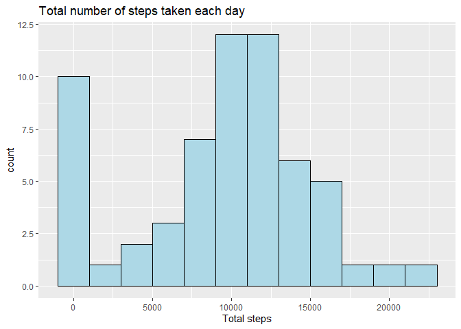
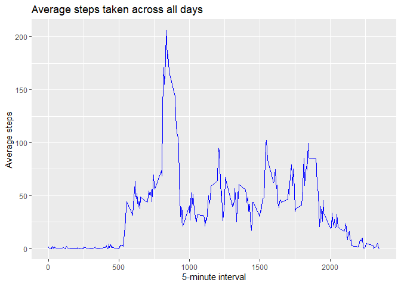
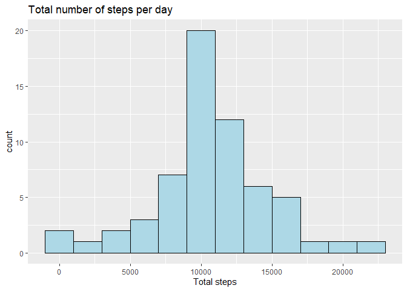

## Loading and preprocessing the data


```r
library(tidyverse)
library(pander)

data <- read_csv("activity.csv")

str(data)
```

```
## tibble [17,568 x 3] (S3: spec_tbl_df/tbl_df/tbl/data.frame)
##  $ steps   : num [1:17568] NA NA NA NA NA NA NA NA NA NA ...
##  $ date    : Date[1:17568], format: "2012-10-01" "2012-10-01" ...
##  $ interval: num [1:17568] 0 5 10 15 20 25 30 35 40 45 ...
##  - attr(*, "spec")=
##   .. cols(
##   ..   steps = col_double(),
##   ..   date = col_date(format = ""),
##   ..   interval = col_double()
##   .. )
```

```r
pander(head(data))
```


-------------------------------
 steps      date      interval 
------- ------------ ----------
  NA     2012-10-01      0     

  NA     2012-10-01      5     

  NA     2012-10-01      10    

  NA     2012-10-01      15    

  NA     2012-10-01      20    

  NA     2012-10-01      25    
-------------------------------

## What is mean total number of steps taken per day?

1. Calculate the total number of steps taken per day


```r
## Calculating total number of steps per day
grouped_data_sum <- data %>%
  group_by(date) %>%
  summarise(sumsteps = sum(steps, na.rm = TRUE))
```

2. Make a histogram of the total number of steps taken each day


```r
hdata <- ggplot(grouped_data_sum, aes(x = sumsteps)) +
  geom_histogram(binwidth = 2000,color = "black ",fill = "lightblue") + 
  labs(title = "Total number of steps taken each day") + 
  xlab("Total steps")

print(hdata)
```

<!-- -->

3. Calculate and report the mean and median of the total number of steps taken per day


```r
pander(tibble(Mean = mean(grouped_data_sum$sumsteps), Median = median(grouped_data_sum$sumsteps)))
```


---------------
 Mean   Median 
------ --------
 9354   10395  
---------------

## What is the average daily activity pattern?

1. Make a time series plot of the 5-minute interval (x-axis) and the average number of steps taken, averaged across all days (y-axis)


```r
grouped_data_interval <- data %>%
    group_by(interval) %>%
    summarise(stepsmean = mean(steps, na.rm = TRUE))

tplot <- ggplot(grouped_data_interval, aes(x = interval, y = stepsmean)) +
    geom_line(color = "blue") +
    xlab("5-minute interval") + 
    ylab("Average steps") +
    labs(title = "Average steps taken across all days")

print(tplot)
```

<!-- -->

2. Which 5-minute interval, on average across all the days in the dataset, contains the maximum number of steps?


```r
pander(filter(grouped_data_interval, stepsmean == max(stepsmean)))
```


----------------------
 interval   stepsmean 
---------- -----------
   835        206.2   
----------------------


## Imputing missing values

1. Calculate and report the total number of missing values in the dataset


```r
sum(is.na(data))
```

```
## [1] 2304
```

2. Devise a strategy for filling in all of the missing values in the dataset. The strategy does not need to be sophisticated. For example, you could use the mean/median for that day, or the mean for that 5-minute interval, etc.

3. Create a new dataset that is equal to the original dataset but with the missing data filled in.


```r
data2 <- data

dataNoNA <- data[!is.na(data$steps),]

data2$steps[is.na(data2$steps)] <- tapply(dataNoNA$steps, dataNoNA$interval, mean)

str(data2)
```

```
## tibble [17,568 x 3] (S3: spec_tbl_df/tbl_df/tbl/data.frame)
##  $ steps   : num [1:17568] 1.717 0.3396 0.1321 0.1509 0.0755 ...
##  $ date    : Date[1:17568], format: "2012-10-01" "2012-10-01" ...
##  $ interval: num [1:17568] 0 5 10 15 20 25 30 35 40 45 ...
##  - attr(*, "spec")=
##   .. cols(
##   ..   steps = col_double(),
##   ..   date = col_date(format = ""),
##   ..   interval = col_double()
##   .. )
```
Does `data2` contain NA values? 


```r
any(is.na(data2))
```

```
## [1] FALSE
```

4. Make a histogram of the total number of steps taken each day and Calculate and report the mean and median total number of steps taken per day. Do these values differ from the estimates from the first part of the assignment? What is the impact of imputing missing data on the estimates of the total daily number of steps?


```r
total_steps_2 <- data2 %>%
    group_by(date) %>%
    summarise(sumsteps = sum(steps))

ggplot(total_steps_2, aes(x = sumsteps)) +
    geom_histogram(binwidth = 2000,color = "black ",fill = "lightblue") + 
    labs(title = "Total number of steps per day") + 
    xlab("Total steps")
```

<!-- -->

```r
pander(tibble(Mean = mean(total_steps_2$sumsteps), Median = median(total_steps_2$sumsteps)))
```


----------------
 Mean    Median 
------- --------
 10766   10766  
----------------

Yes, the values differ from the first part of the assignment. The impact of imputing missing data for the total daily nymber of steps is that the mean becomes equal to the median. 

## Are there differences in activity patterns between weekdays and weekends?

1. Create a new factor variable in the dataset with two levels – “weekday” and “weekend” indicating whether a given date is a weekday or weekend day.

**NOTE: My system is in Spanish**


```r
weekend1 <- c("sábado", "domingo")

data2$days <- factor(weekdays(as.Date(data2$date)) %in% weekend1, levels = c(FALSE, TRUE), labels = c("weekday", "weekend"))

unique(data2$days)
```

```
## [1] weekday weekend
## Levels: weekday weekend
```

2. Make a panel plot containing a time series plot of the 5-minute interval (x-axis) and the average number of steps taken, averaged across all weekday days or weekend days (y-axis).


```r
dayssubset <- data2 %>%
    group_by(interval, days) %>%
    summarise(stepsmean = mean(steps))

ggplot(dayssubset, aes(x = interval, y = stepsmean , color = days)) +
  geom_line() +
  facet_grid(rows = vars(days))+
  ylab("Average steps") +
  xlab("5-minute interval") +
  labs(title = "Average steps by time interval on weekdays and weekends")
```

<!-- -->
